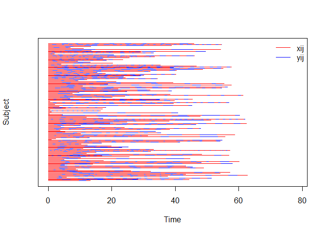
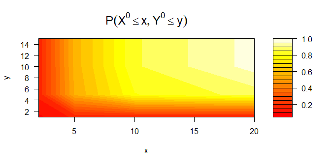
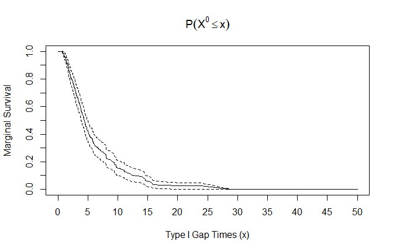
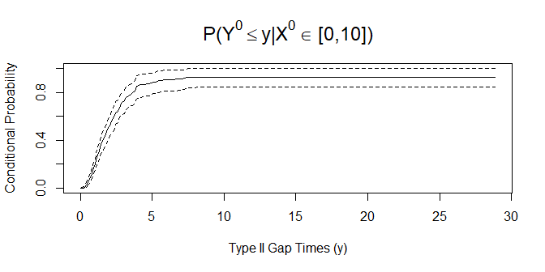

Bivariate Alternating Recurrent Event Data Analysis (BivRec)
================

<!-- README.md is generated from README.Rmd. Please edit that file -->
Alternating recurrent event data arise frequently in biomedical and social sciences where two types of events such as hospital admissions and discharge occur alternatively over time. BivRec implements a collection of non-parametric and semiparametric methods to analyze such data.

The main functions are:
- biv.rec.fit: Use for the estimation of covariate effects on the two alternating event gap times (Xij and Yij) using semiparametric methods. The method options are "Lee.et.al" and "Chang".
- biv.rec.np: Use for the estimation of the joint cumulative distribution funtion (cdf) for the two alternating events gap times (Xij and Yij) as well as the marginal survival function for type I gap times (Xij) and the conditional cdf of the type II gap times (Yij) given an interval of type I gap times (Xij) in a non-parametric fashion.

The package also provides options to simulate and visualize the data and results of analysis.

Installation
------------

BivRec depends on the following system requirements:
- Rtools. Download Rtools 35 from <https://cran.r-project.org/bin/windows/Rtools/>

Once those requirements are met you can install BivRec from github as follows:

``` r
#Installation requires devtools package.
#install.packages("devtools")
library(devtools)
assignInNamespace("version_info", c(devtools:::version_info, 
                                    list("3.5" = list(version_min = "3.3.0", version_max = "99.99.99", 
                                    path = "bin"))), "devtools")
find_rtools()
#Make sure the results of previous command is true
install_github("SandraCastroPearson/BivRec")
```

Example
-------

This is an example using a simulated data set.

``` r
# Simulate bivariate alternating recurrent event data
library(BivRec)
#> Loading required package: survival
set.seed(8822)
biv.rec.data <- biv.rec.sim(nsize=150, beta1=c(0.5,0.5), beta2=c(0,-0.5), tau_c=63, set=1.1)
head(biv.rec.data)
#>   id epi      xij      yij       ci d1 d2 a1        a2
#> 1  1   1 9.679047 2.282131 13.29129  1  1  1 0.4177872
#> 2  1   2 1.330113 0.000000 13.29129  0  0  1 0.4177872
#> 3  2   1 4.374004 2.684083 44.30019  1  1  0 0.2733379
#> 4  2   2 3.773545 2.299688 44.30019  1  1  0 0.2733379
#> 5  2   3 2.426768 2.552366 44.30019  1  1  0 0.2733379
#> 6  2   4 3.314417 1.491540 44.30019  1  1  0 0.2733379

# Plot gap times
biv.rec.plot(formula = id + epi ~ xij + yij, data = biv.rec.data)
```



``` r
# Apply the non-parametric method of Huang and Wang (2005) and visualize marginal and conditional results

# To save plots in a pdf file un-comment the following lines of code: 
# pdf("nonparamplots.pdf")
# par(mfrow=c(3,1))
nonpar.result <- biv.rec.np(formula = id + epi + xij + yij + d1 + d2 ~ 1,
           data=biv.rec.data, ai=1, u1 = c(2, 5, 10, 20), u2 = c(1, 5, 10, 15),
           conditional = TRUE, given.interval=c(0, 10), jointplot=TRUE,
           marginalplot = TRUE, condiplot = TRUE)
#> [1] "Original number of observations: 866 for 150 individuals"
#> [1] "Observations to be used in analysis: 866 for 150 individuals"
#> [1] "Estimating joint cdf and marginal survival"
```



    #> [1] "Estimating conditional CDF with 95% CI using 100 Bootstrap samples"



``` r

# To close the pdf file with the saved plots un-comment the following line of code
# dev.off()

head(nonpar.result$joint.cdf)
#>   x  y Joint.Probability         SE     0.025%    0.975%
#> 1 2  1        0.08928573 0.01892769 0.05218813 0.1263833
#> 2 2  5        0.16417087 0.02547234 0.11424599 0.2140957
#> 3 2 10        0.16417087 0.02547234 0.11424599 0.2140957
#> 4 2 15        0.16417087 0.02547234 0.11424599 0.2140957
#> 5 5  1        0.16154877 0.02594191 0.11070356 0.2123940
#> 6 5  5        0.55426760 0.03836429 0.47907497 0.6294602
head(nonpar.result$marginal.survival)
#>        Time Marginal.Survival           SE    0.025%    0.975%
#> 1 0.5165504         0.9998352 1.354416e-05 0.9998087 0.9998617
#> 2 0.5895802         0.9996693 1.647758e-04 0.9993463 0.9999922
#> 3 0.5940876         0.9989134 3.353599e-04 0.9982561 0.9995707
#> 4 0.6090161         0.9987475 8.197330e-04 0.9971409 1.0000000
#> 5 0.6496297         0.9985816 8.980838e-04 0.9968214 1.0000000
#> 6 0.6529765         0.9982858 9.981078e-04 0.9963296 1.0000000
head(nonpar.result$conditional.cdf)
#>     Time Conditional.Probability  Bootstrap SE Bootstrap 0.025%
#> 1 0.0043                  0.0000        0.0000             0.00
#> 2 0.1493                  0.0007        0.0007             0.00
#> 3 0.2943                  0.0066        0.0060             0.00
#> 4 0.4393                  0.0216        0.0106             0.01
#> 5 0.5843                  0.0601        0.0172             0.03
#> 6 0.7293                  0.1011        0.0209             0.06
#>   Bootstrap 0.975%
#> 1             0.00
#> 2             0.00
#> 3             0.02
#> 4             0.04
#> 5             0.09
#> 6             0.14

# Apply Lee C, Huang CY, Xu G, Luo X (2017) method using multiple covariates
fit.lee <- biv.rec.fit(formula = id + epi + xij + yij + d1 + d2 ~ a1 + a2,
                data=biv.rec.data, method="Lee.et.al", CI=0.99)
#> [1] "Original number of observations: 866 for 150 individuals"
#> [1] "Observations to be used in analysis: 866 for 150 individuals"
#> [1] "Fitting model with covariates: a1,a2"
#> [1] "Estimating standard errors/confidence intervals"
fit.lee$covariate.effects
#>          Estimate        SE     0.005%    0.995%
#> xij a1  0.5389506 0.1333088  0.1955699 0.8823313
#> xij a2  0.4156700 0.2292714 -0.1748941 1.0062340
#> yij a1  0.1824334 0.1796552 -0.2803277 0.6451945
#> yij a2 -0.4560038 0.3181004 -1.2753761 0.3633685

# To apply Chang (2004) method use method="Chang".
# biv.rec.chang<- biv.rec.fit(formula = id + epi + xij + yij + d1 + d2 ~ a1 + a2, 
# data=biv.rec.data, method="Chang", CI=0.99)
```
