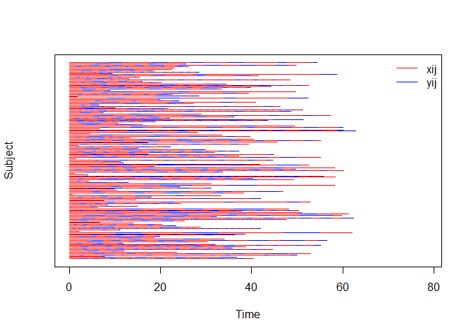
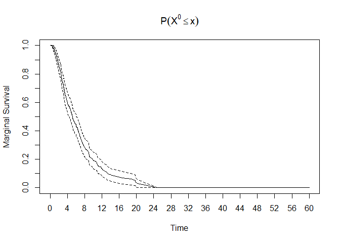
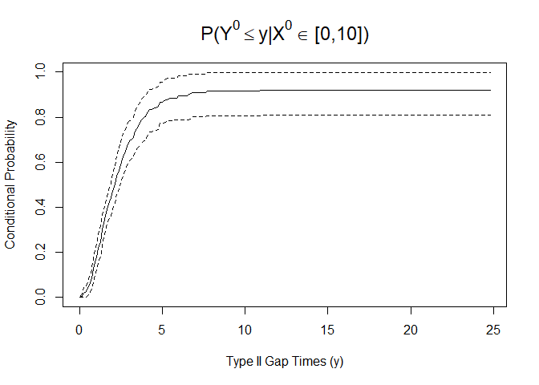

<!-- README.md is generated from README.Rmd. Please edit that file -->
Bivariate Alternating Recurrent Event Data Analysis (BivRec)
============================================================

Alternating recurrent event data arise frequently in biomedical and social sciences where two types of events such as hospital admissions and discharge occur alternatively over time. BivRec implements a collection of non-parametric and semiparametric methods to analyze such data.

The main functions are:
+ biv.rec.fit: Use for the estimation of covariate effects on the two alternating event gap times (Xij and Yij) using semiparametric methods. The method options are "Lee.et.al" and "Chang".
+ biv.rec.np: Use for the estimation of the joint cumulative distribution funtion (cdf) for the two alternating events gap times (Xij and Yij) as well as the marginal survival function for type I gap times (Xij) and the conditional cdf of the type II gap times (Yij) given an interval of type I gap times (Xij) in a non-parametric fashion.

The package also provides options to simulate and visualize the data and results of analysis.

Installation
------------

You can install BivRec from github as follows:

``` r
# BivRec installation requires devtools and Rtools35
# install.packages("devtools")
# Download Rtools 35 from https://cran.r-project.org/bin/windows/Rtools/
library(devtools)
assignInNamespace("version_info", c(devtools:::version_info, 
                                    list("3.5" = list(version_min = "3.3.0", version_max = "99.99.99", 
                                    path = "bin"))), "devtools")
find_rtools()
install_github("SandraCastroPearson/BivRec")
```

Example
-------

This is a basic example which shows you how to solve a common problem:

``` r
## basic example code
library(BivRec)
#> Loading required package: survival

# Simulate bivariate alternating recurrent event data
set.seed(1234)
biv.rec.data <- biv.rec.sim(nsize=150, beta1=c(0.5,0.5), beta2=c(0,-0.5), tau_c=63, set=1.1)
head(biv.rec.data)
#>   id epi      xij      yij       ci d1 d2 a1        a2
#> 1  1   1 2.411938 1.608223 40.41911  1  1  0 0.4390421
#> 2  1   2 1.405158 1.358592 40.41911  1  1  0 0.4390421
#> 3  1   3 2.188781 1.633935 40.41911  1  1  0 0.4390421
#> 4  1   4 2.045351 1.071826 40.41911  1  1  0 0.4390421
#> 5  1   5 5.047795 2.175306 40.41911  1  1  0 0.4390421
#> 6  1   6 2.503392 1.324126 40.41911  1  1  0 0.4390421

# Plot gap times
biv.rec.plot(formula = id + epi ~ xij + yij, data = biv.rec.data)
```



``` r

#Apply the non-parametric method of Huang and Wang (2005) and visualize marginal and conditional results.
nonpar.result <- biv.rec.np(formula = id + epi + xij + yij + d1 + d2 ~ 1,
           data=biv.rec.data, ai=1, u1 = c(2, 5, 10, 20), u2 = c(1, 5, 10, 15),
           conditional = TRUE, given.interval=c(0, 10), jointplot=FALSE,
           marginalplot = TRUE, condiplot = TRUE)
#> [1] "Original Number of Observations: 856 for 150 individuals"
#> [1] "Observations to be used in Analysis: 856 for 150 individuals"
#> [1] "Estimating joint cdf and marginal survival"
```



    #> [1] "Estimating Conditional CDF with 95% CI using 100 Sample Bootstrap"



``` r
head(nonpar.result$joint.cdf)
#>   x  y Joint.Probability         SE     0.025%    0.975%
#> 1 2  1        0.07765854 0.01916368 0.04009842 0.1152187
#> 2 2  5        0.13928503 0.02373745 0.09276048 0.1858096
#> 3 2 10        0.13928503 0.02373745 0.09276048 0.1858096
#> 4 2 15        0.13928503 0.02373745 0.09276048 0.1858096
#> 5 5  1        0.13053700 0.02323335 0.08500047 0.1760735
#> 6 5  5        0.46872829 0.03686254 0.39647903 0.5409775
head(nonpar.result$marginal.survival)
#>        Time Marginal.Survival           SE    0.025%    0.975%
#> 1 0.2697386         0.9998851 9.383939e-06 0.9998667 0.9999034
#> 2 0.2759313         0.9997701 1.149293e-04 0.9995449 0.9999954
#> 3 0.2912704         0.9996552 2.292833e-04 0.9992058 1.0000000
#> 4 0.3055601         0.9995402 3.437648e-04 0.9988665 1.0000000
#> 5 0.3203637         0.9994253 4.582784e-04 0.9985271 1.0000000
#> 6 0.3229318         0.9993103 5.728047e-04 0.9981877 1.0000000
head(nonpar.result$conditional.cdf)
#>     Time Conditional.Probability  Bootstrap SE Bootstrap 0.025%
#> 1 0.0112                  0.0000        0.0000             0.00
#> 2 0.1358                  0.0060        0.0040             0.00
#> 3 0.2604                  0.0197        0.0112             0.00
#> 4 0.3850                  0.0267        0.0133             0.00
#> 5 0.5095                  0.0401        0.0160             0.01
#> 6 0.6341                  0.0660        0.0201             0.02
#>   Bootstrap 0.975%
#> 1             0.00
#> 2             0.01
#> 3             0.04
#> 4             0.05
#> 5             0.07
#> 6             0.10

#Apply Lee C, Huang CY, Xu G, Luo X (2017) method using multiple covariates.
fit.lee <- biv.rec.fit(formula = id + epi + xij + yij + d1 + d2 ~ a1 + a2,
                data=biv.rec.data, method="Lee.et.al", CI=0.99)
#> [1] "Original Number of Observations: 856 for 150 individuals"
#> [1] "Observations to be used in Analysis: 856 for 150 individuals"
#> [1] "fitting model with covariates: a1,a2"
#> [1] "Estimating standard errors/confidence intervals"
fit.lee$covariate.effects
#>          Estimate        SE     0.005%    0.995%
#> xij a1  0.5744414 0.1306845  0.2378204 0.9110623
#> xij a2  0.5128054 0.2707497 -0.1845995 1.2102103
#> yij a1  0.2888306 0.1985364 -0.2225653 0.8002266
#> yij a2 -0.6207422 0.3842713 -1.6105596 0.3690751

# To apply Chang (2004) method use method="Chang".
```
