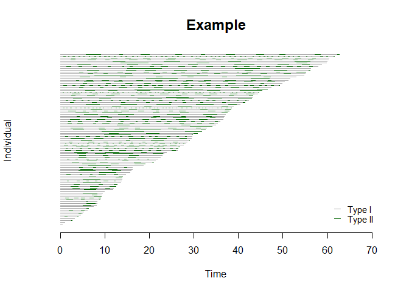

Bivariate Alternating Recurrent Event Data Analysis (BivRec)
================

<!-- README.md is generated from README.Rmd. Please edit that file -->

Alternating recurrent event data arise frequently in biomedical and
social sciences where two types of events such as hospital admissions
and discharges occur alternatively over time. BivRec implements a
collection of nonparametric and semiparametric methods to analyze such
data.

The main functions are:  
\- bivrecReg: Use for the estimation of covariate effects on the two
alternating event gap times (Xij and Yij) using semiparametric methods.
The method options are “Lee.et.al” and “Chang”.  
\- bivrecNP: Use for the estimation of the joint cumulative distribution
function (cdf) for the two alternating events gap times (Xij and Yij) as
well as the marginal survival function for type I gap times (Xij) and
the conditional cdf of the type II gap times (Yij) given an interval of
type I gap times (Xij) in a nonparametric fashion.

The package also provides options to simulate and visualize the data and
results of analysis.

## Installation

BivRec depends on the following system requirements:  
\- Rtools. Download Rtools 35 from
<https://cran.r-project.org/bin/windows/Rtools/>

Once those requirements are met you can install BivRec from github as
follows:

``` r
#Installation requires devtools package.
#install.packages("devtools")
library(devtools)
#install_github("SandraCastroPearson/BivRec")
```

## Example

This is an example using a simulated data set.

``` r
# Simulate bivariate alternating recurrent event data
library(BivRec)
set.seed(28)
sim_data <- simBivRec(nsize=100, beta1=c(0.5,0.5), beta2=c(0,-0.5), tau_c=63, set=1.1)
head(sim_data)
#>   id epi      xij      yij       ci d1 d2 a1        a2
#> 1  1   1 5.396514 2.649410 11.76916  1  1  0 0.7455188
#> 2  1   2 3.723235 0.000000 11.76916  0  0  0 0.7455188
#> 3  2   1 5.648637 2.247070 45.31703  1  1  0 0.3344112
#> 4  2   2 2.949107 2.032798 45.31703  1  1  0 0.3344112
#> 5  2   3 4.437588 2.936018 45.31703  1  1  0 0.3344112
#> 6  2   4 3.114917 3.337000 45.31703  1  1  0 0.3344112

# Create a bivrecSurv object
bivrec_object <- with(sim_data, bivrecSurv(id, epi, xij, yij, d1, d2))
# Plot gap times
plot(bivrec_object, main="Example", type = c("Type I", "Type II"), col = c("darkgrey","darkgreen"))
```

<!-- -->

Nonparametric Analysis

``` r
# Apply the nonparametric method of Huang and Wang (2005) and visualize joint, marginal and conditional results

library(BivRec)
npresult <- bivrecNP(response = with(sim_data, bivrecSurv(id, epi, xij, yij, d1, d2)),
                ai=1, u1 = seq(1, 15, 0.5), u2 = seq(1, 15, 0.5), conditional = TRUE,
                given.interval = c(1, 10), level = 0.99)
#> [1] "Estimating joint CDF and marginal survival"
#> [1] "Estimating conditional cdf with 99% confidence interval using 200 bootstrap samples"
head(npresult)
#> 
#> Joint CDF:
#>    x   y Joint Probability         SE   Lower .99 Upper .99
#> 1 1 1.0        0.05900966 0.01967078 0.008341088 0.1096782
#> 2 1 1.5        0.06086021 0.01995590 0.009457207 0.1122632
#> 3 1 2.0        0.06179946 0.01994861 0.010415238 0.1131837
#> 4 1 2.5        0.06179946 0.01994861 0.010415238 0.1131837
#> 5 1 3.0        0.06179946 0.01994861 0.010415238 0.1131837
#> 6 1 3.5        0.06179946 0.01994861 0.010415238 0.1131837
#> 
#> Marginal Survival:
#>         Time Marginal Survival           SE Lower .99 Upper .99
#> 1 0.3120105         0.9997561 0.0000243843 0.9996933 0.9998189
#> 2 0.3408594         0.9995122 0.0002438430 0.9988841 1.0000000
#> 3 0.3769168         0.9992683 0.0004858536 0.9980168 1.0000000
#> 4 0.3793933         0.9990302 0.0007282511 0.9971543 1.0000000
#> 5 0.3859942         0.9987863 0.0007635383 0.9968196 1.0000000
#> 6 0.3878224         0.9985424 0.0009969369 0.9959745 1.0000000
#> 
#> Conditional CDF:
#>      Time Conditional Probability  Bootstrap SE Bootstrap Lower .99
#> 1 0.0000                  0.0000        0.0000                0.00
#> 2 0.0776                  0.0000        0.0000                0.00
#> 3 0.1551                  0.0000        0.0000                0.00
#> 4 0.2327                  0.0018        0.0011                0.00
#> 5 0.3103                  0.0095        0.0038                0.00
#> 6 0.3878                  0.0224        0.0081                0.01
#>   Bootstrap Upper .99
#> 1                0.00
#> 2                0.00
#> 3                0.00
#> 4                0.00
#> 5                0.02
#> 6                0.04
plot(npresult)
```

<!-- --><!-- -->

``` r

# To save individual plots in a pdf file un-comment the following line of code: 
# pdf("nonparam_jointcdfplot.pdf")
# plotJoint(npresult)
# dev.off()
# pdf("nonparam_marginalplot.pdf")
# plotMarg(npresult)
# dev.off()
# pdf("nonparam_conditionaplot.pdf")
# plotCond(npresult)
# dev.off()
```

Semiparametric Regression Analysis

``` r
#Explore how the response changes by levels of a categorical covariate using a plot. 
#Use attach as follows or specifiy each vector using the $ operator (sim_data$id, sim_data$epi, etc.)

attach(sim_data)
plot(x = bivrecSurv(id, epi, xij, yij, d1, d2), by = data.frame(a1, a2), 
     type = c("Type I", "Type II"), col = c("darkgrey","darkgreen"))
#> [1] "a2 not used - either continuous or had more than 6 levels."
#> [1] "Subjects for plots: 100."
```

<!-- -->

``` r
detach(sim_data)

# Apply Lee, Huang, Xu, Luo (2018) method using multiple covariates.
lee_fit <- bivrecReg(bivrecSurv(id, epi, xij, yij, d1, d2) ~ a1 + a2,
                    data= sim_data, "Lee.et.al")
#> [1] "Fitting model with covariates: a1, a2"
#> [1] "Estimating standard errors"

summary(lee_fit)
#> 
#> Call:
#> bivrecReg(formula = bivrecSurv(id, epi, xij, yij, d1, d2) ~ a1 + 
#>     a2, data = sim_data, method = "Lee.et.al")
#> 
#> Number of Subjects:
#> 100
#> 
#> Coefficients:
#>         Estimates      SE        z  Pr(>|z|)    
#> xij a1  0.686004  0.171881  3.9912    3e-05 ***
#> xij a2  0.293041  0.304425  0.9626  0.16787    
#> yij a1 -0.057268  0.294032 -0.1948  0.42279    
#> yij a2 -0.911427  0.480674 -1.8961  0.02897 *  
#> ---
#> Signif. codes:  0 '***' 0.001 '**' 0.01 '*' 0.05 '.' 0.1 ' ' 1
#> 
#> exp(coefficients):
#>         exp(coeff) Lower .95 Upper .95
#> xij a1    1.98576   1.41782    2.7812
#> xij a2    1.34050   0.73814    2.4344
#> yij a1    0.94434   0.53070    1.6804
#> yij a2    0.40195   0.15668    1.0312

# To apply Chang (2004) method use method="Chang".
# chang_fit <- bivrecReg(bivrecSurv(id, epi, xij, yij, d1, d2) ~ a1 + a2,
#                    data= sim_data, "Chang")
```
