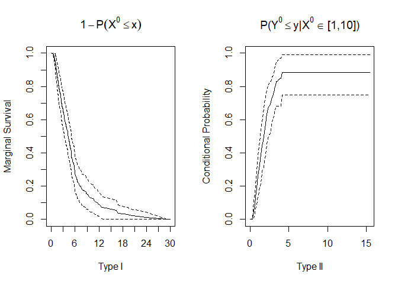
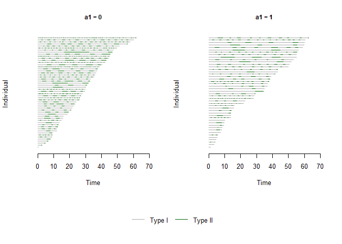

Bivariate Alternating Recurrent Event Data Analysis (BivRec)
================

<!-- README.md is generated from README.Rmd. Please edit that file -->

Alternating recurrent event data arise frequently in biomedical and
social sciences where two types of events such as hospital admissions
and discharges occur alternatively over time. BivRec implements a
collection of nonparametric and semiparametric methods to analyze such
data.

The main functions are:  
\- bivrecReg: Use for the estimation of covariate effects on the two
alternating event gap times (Xij and Yij) using semiparametric methods.
The method options are “Lee.et.al” and “Chang”.  
\- bivrecNP: Use for the estimation of the joint cumulative distribution
funtion (cdf) for the two alternating events gap times (Xij and Yij) as
well as the marginal survival function for type I gap times (Xij) and
the conditional cdf of the type II gap times (Yij) given an interval of
type I gap times (Xij) in a nonparametric fashion.

The package also provides options to simulate and visualize the data and
results of analysis.

## Installation

BivRec depends on the following system requirements:  
\- Rtools. Download Rtools 35 from
<https://cran.r-project.org/bin/windows/Rtools/>

Once those requirements are met you can install BivRec from github as
follows:

``` r
#Installation requires devtools package.
#install.packages("devtools")
library(devtools)
#install_github("SandraCastroPearson/BivRec")
```

## Example

This is an example using a simulated data set.

``` r
# Simulate bivariate alternating recurrent event data
library(BivRec)
#> Registered S3 method overwritten by 'BivRec':
#>   method       from    
#>   plot.formula graphics
set.seed(288)
sim_data <- simBivRec(nsize=100, beta1=c(0.5,0.5), beta2=c(0,-0.5), tau_c=63, set=1.1)
head(sim_data)
#>   id epi      xij       yij        ci d1 d2 a1         a2
#> 1  1   1 1.886882 1.4385977  5.218676  1  1  0 0.01429619
#> 2  1   2 1.459066 0.4341303  5.218676  1  0  0 0.01429619
#> 3  2   1 2.812824 0.7359517 18.667124  1  1  1 0.74366631
#> 4  2   2 3.957610 1.0279152 18.667124  1  1  1 0.74366631
#> 5  2   3 3.966836 0.8669458 18.667124  1  1  1 0.74366631
#> 6  2   4 3.489983 1.4055131 18.667124  1  1  1 0.74366631

# Create a bivrecSurv object
bivrec_object <- with(sim_data, bivrecSurv(id, epi, xij, yij, d1, d2))
# Plot gap times
plot(bivrec_object, main="Example", type = c("Type I", "Type II"))
```

<!-- -->

Nonparametric
Analysis

``` r
# Apply the nonparametric method of Huang and Wang (2005) and visualize joint, marginal and conditional results

library(BivRec)
npresult <- bivrecNP(response = bivrec_object, ai=1,
                u1 = seq(2, 25, 1), u2 = seq(1, 20, 1), conditional = TRUE,
                given.interval = c(0, 10), level = 0.99)
#> [1] "Estimating joint CDF and marginal survival"
#> [1] "Estimating conditional cdf with 99% confidence interval using 200 bootstrap samples"
head(npresult)
#> 
#> Joint CDF:
#>    x y Joint Probability         SE  Lower .99 Upper .99
#> 1 2 1         0.0908710 0.02354341 0.03022720 0.1515148
#> 2 2 2         0.1481150 0.03075241 0.06890205 0.2273279
#> 3 2 3         0.1579445 0.03134974 0.07719294 0.2386961
#> 4 2 4         0.1579445 0.03134974 0.07719294 0.2386961
#> 5 2 5         0.1607501 0.03132463 0.08006321 0.2414370
#> 6 2 6         0.1607501 0.03132463 0.08006321 0.2414370
#> 
#> Marginal Survival:
#>         Time Marginal Survival           SE Lower .99 Upper .99
#> 1 0.5177089         0.9993266 6.763374e-05 0.9991524 0.9995008
#> 2 0.5743254         0.9986532 6.729472e-04 0.9969198 1.0000000
#> 3 0.5776458         0.9979798 1.340786e-03 0.9945262 1.0000000
#> 4 0.6523116         0.9974988 2.009200e-03 0.9923234 1.0000000
#> 5 0.7016157         0.9941318 2.087441e-03 0.9887549 0.9995087
#> 6 0.7059578         0.9936508 3.901686e-03 0.9836007 1.0000000
#> 
#> Conditional CDF:
#>      Time Conditional Probability  Bootstrap SE Bootstrap Lower .99
#> 1 0.0000                  0.0000        0.0000                   0
#> 2 0.0669                  0.0000        0.0000                   0
#> 3 0.1337                  0.0000        0.0000                   0
#> 4 0.2006                  0.0013        0.0012                   0
#> 5 0.2675                  0.0066        0.0049                   0
#> 6 0.3344                  0.0155        0.0085                   0
#>   Bootstrap Upper .99
#> 1                0.00
#> 2                0.00
#> 3                0.00
#> 4                0.00
#> 5                0.02
#> 6                0.04
plot(npresult)
```

<!-- --><!-- -->

``` r

# To save individual plots in a pdf file un-comment the following line of code: 
# pdf("nonparam_jointcdfplot.pdf")
# plotJoint(npresult)
# dev.off()
# pdf("nonparam_marginalplot.pdf")
# plotMarg(npresult)
# dev.off()
# pdf("nonparam_conditionaplot.pdf")
# plotCond(npresult)
# dev.off()
```

Semiparametric Regression
Analysis

``` r
#Explore how the response changes by levels of a categorical covariate using a plot.
plot(x = bivrecSurv(id, epi, xij, yij, d1, d2) ~ a1 + a2, data = sim_data,
    type = c("Type I", "Type II"))
#> [1] "a2 not used - either continuous or had more than 6 levels."
#> [1] "Original number of subjects: 100. Subjects for plots: 100"
```

<!-- -->

``` r

# Apply Lee, Huang, Xu, Luo (2018) method using multiple covariates.
lee_fit <- bivrecReg(bivrecSurv(id, epi, xij, yij, d1, d2) ~ a1 + a2,
                    data= sim_data, "Lee.et.al")
#> [1] "Fitting model with covariates: a1, a2"
#> [1] "Estimating standard errors"

summary(lee_fit)
#> 
#> Call:
#> bivrecReg(formula = bivrecSurv(id, epi, xij, yij, d1, d2) ~ a1 + 
#>     a2, data = sim_data, method = "Lee.et.al")
#> 
#> Number of Subjects:
#> 100
#> 
#> Coefficients:
#>         Estimates     SE        z  Pr(>|z|)   
#> xij a1   0.22050  0.17485  1.2611  0.10364   
#> xij a2   0.59174  0.30020  1.9711  0.02435 * 
#> yij a1  -0.59171  0.22379 -2.6441  0.00410 **
#> yij a2  -0.44510  0.51001 -0.8727  0.19141   
#> ---
#> Signif. codes:  0 '***' 0.001 '**' 0.01 '*' 0.05 '.' 0.1 ' ' 1
#> 
#> exp(coefficients):
#>         exp(coeff) Lower .95 Upper .95
#> xij a1    1.24670   0.88497    1.7563
#> xij a2    1.80712   1.00336    3.2548
#> yij a1    0.55338   0.35689    0.8580
#> yij a2    0.64076   0.23582    1.7411

# To apply Chang (2004) method use method="Chang".
# chang_fit <- bivrecReg(bivrecSurv(id, epi, xij, yij, d1, d2) ~ a1 + a2,
#                    data= sim_data, "Chang")
```
